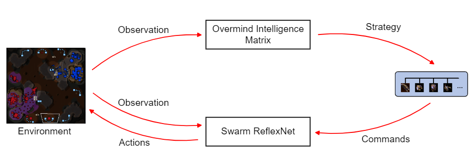
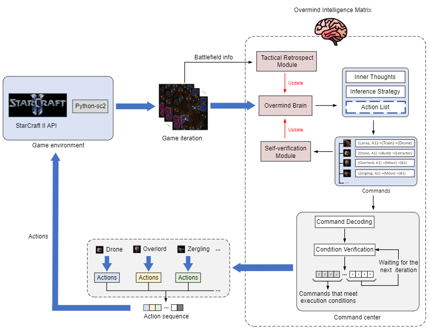

# SwarmBrain: Embodied agent for real-time strategy game StarCraft II via large language models

Fig. 1 The framework of the interaction between SwarmBrain and StarCraft II environment.

Fig. 2 The framework of the Overmind Intelligence Matrix.

## Method description
The SwarmBrain comprises two key components: 
(1) an Overmind Intelligence Matrix, powered by state-of-the-art LLMs, is designed to orchestrate macro-level strategies from a high-level perspective. This matrix emulates the overarching consciousness of the Zerg intelligence brain, synthesizing strategic foresight with the aim of allocating resources, directing expansion, and coordinating multi-pronged assaults.
(2) a Swarm ReflexNet, which is the agile counterpart to the calculated deliberation of the Overmind Intelligence Matrix. Due to the inherent latency in LLM reasoning, the Swarm ReflexNet employs a condition-response state machine framework, enabling expedited tactical responses for fundamental Zerg unit maneuvers.
The paper link: [https://arxiv.org/abs/2401.17749](https://arxiv.org/abs/2401.17749)
The demo video: ([B站视频 https://www.bilibili.com/video/BV1jZ421a7b7/](https://www.bilibili.com/video/BV1jZ421a7b7/)) ([油管视频 https://www.youtube.com/watch?v=-F0PQJPI4HM](https://www.youtube.com/watch?v=-F0PQJPI4HM))

## Note
1. Currently, the code implementation is not consistent with the arXiv paper because we have made some improvements. 
2. Since the performance of SwarmBrain is highly dependent on that of the LLM, there are times when the LLM may not perform well, causing SwarmBrain to struggle against the more challenging computer opponents.
3. In this code version, we did not include the update process for the Tactical Retrospect Module and the Self-verification Module due to time constraints. These two modules were only added during the training process.

## How to launch your own SwarmBrain?
### 1. Download the StarCraft II.
Firstly, you need to download the StarCraft II ([https://starcraft2.blizzard.com/](https://starcraft2.blizzard.com/)), we highly suggest you also download the Battle.net launcher. If you have not downloaded the Battle.net launcher, you may not be able to view SwarmBrain’s game videos due to version issues, causing you to miss some exciting replays. So a good habit is to always open the Battle.net launcher to update StarCraft II.

### 2. Download the map
You can download the official Blizzard map from ([Blizzard/s2client-proto](https://github.com/Blizzard/s2client-proto?tab=readme-ov-file#downloads)). Then, extract these maps into the root of the SC2 maps directory (Mine is **C:\Program Files (x86)\StarCraft II\Maps**). To be noted, for this code version, you can only use "**AutomatonLE**" from "**Ladder 2019 Season 1**". 

### 3. Replace the ChatGPT API
You need to replace your ChatGPT API in swarmbrain.py. If you don't know how to find your ChatGPT API, please read this website [where-do-i-find-my-openai-api-key](https://help.openai.com/en/articles/4936850-where-do-i-find-my-openai-api-key).

### 4. Launch the SwarmBrain
Run swarmbrain_launch.py.

